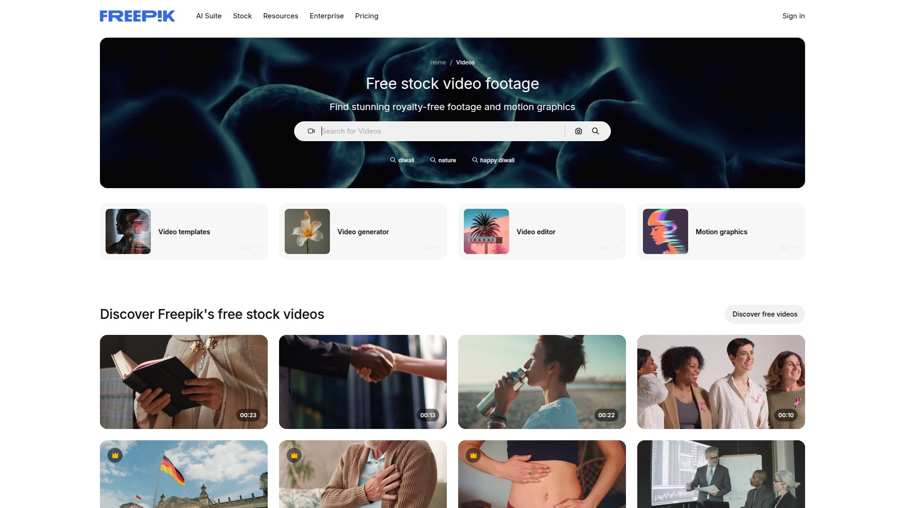
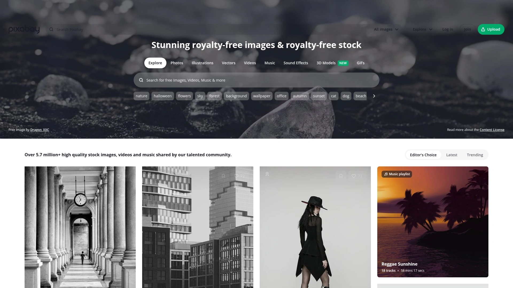
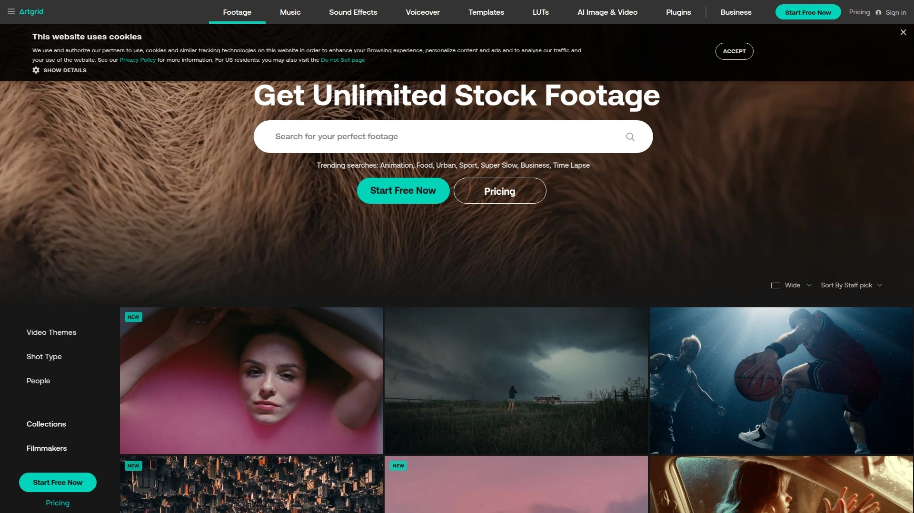

# Top 12 Best Stock Video Platforms in 2025 (Latest Updated)

Finding the right stock footage can transform your video projects from amateur to professional. Whether you're a content creator, marketer, or filmmaker, these platforms offer everything from free HD clips to premium cinematic footage that elevates your visual storytelling without the production costs.

***

## **[Videvo](https://videvo.net)**

Your go-to destination for massive free and premium stock footage libraries with simplified licensing for creators at every level.

Videvo launched in 2012 and now boasts one of the largest collections of free stock footage, motion graphics, and audio clips available online. The platform offers over 50,000 free assets and 50,000 premium stock assets, all with straightforward licensing options including Creative Commons 3.0, Royalty Free, and Videvo Standard Licensing. The library features videos in HD and 4K resolution across diverse categories like nature, business, technology, and more.

What makes Videvo stand out is its commitment to simplifying the licensing process. Free content requires attribution to the original creators, while premium subscriptions eliminate attribution requirements and guarantee royalty-free licensing across all content. The platform constantly updates its library with new clips, ensuring creators have access to fresh, relevant footage. Beyond video, Videvo provides motion graphics, animated backgrounds, music tracks, and sound effects in various genres.

The user-friendly interface allows easy browsing with filters for duration, video quality, licensing type, and category. Preview functionality lets you review clips before downloading, saving time in the selection process.

***

## **[Pexels](https://www.pexels.com)**

Completely free 4K stock videos with zero attribution requirements and commercial licensing included.

Pexels delivers an extensive catalog of high-quality stock videos entirely free for personal and commercial use. The platform features 4K resolution videos without watermarks or logos, perfect for professional projects. Users can download all content without creating an account or providing attribution, though crediting creators is appreciated.

The simple search functionality and intuitive categorization make finding specific footage effortless. Videos span numerous categories including nature, technology, lifestyle, business, and more. The platform maintains consistent quality through community contributions and regular content updates.

Pexels operates under a simplified license allowing free use across any platform including YouTube, social media, websites, and even broadcast. The download process is quick with multiple resolution options to match your project requirements.

---

## **[Mixkit](https://mixkit.co)**

Free broadcast-quality videos, music, and templates with no attribution needed, powered by Envato.

Operated by Envato, Mixkit provides completely free stock videos, music, sound effects, and video templates focused on broadcast-quality content. The platform requires no sign-up, applies no watermarks, and demands no attribution for downloads. All high-definition stock videos are available for commercial and non-commercial use under clear licensing terms.

Content categories include business, technology, fashion, travel, performing arts, and more. Mixkit also offers unique content types like video templates for popular editing software and motion graphics elements. The platform provides both traditional 16:9 format videos and vertical videos optimized for mobile and social platforms.

Videos under the Mixkit Free License can be used in commercial projects including YouTube videos, social media marketing, online ads, and music videos, while the Restricted License covers personal projects. The quality rivals paid alternatives with 4K resolution options available across categories.

---

## **[Pond5](https://www.pond5.com)**

Millions of premium royalty-free clips with new content added every second from professional cinematographers worldwide.

Pond5 operates as one of the industry leaders with a new video added literally every second to their massive library. The platform hosts more than 44 million clips as of January 2025, making it the world's largest collection of stock footage. Major networks like ABC, NBC, and BBC rely on Pond5 for their content needs.

The searchable library allows filtering by resolution, FPS, and specialty video formats like 360 VR. Content includes standard stock footage, historic footage connecting past and present, exclusive content unavailable elsewhere, and vertical videos for mobile platforms. Beyond video, the marketplace offers royalty-free music, sound effects, After Effects templates, stock photos, illustrations, and Photoshop templates.

Pond5 operates on a contributor model where creators set their own prices and earn 50% of revenue. The comprehensive license covers YouTube, TikTok, Vimeo, Twitch, broadcast/OTT, film and TV, commercials, websites, podcasts, games, marketing, and more. Individual clip purchases provide flexibility for projects requiring specific shots.

***

## **[Pixabay](https://pixabay.com)**

Community-driven platform with thousands of free videos under simplified licensing for unlimited commercial use.

Pixabay expanded from photos to include an impressive collection of stock videos, all available under their simplified license permitting commercial use without attribution. The global community of contributors creates diverse footage spanning numerous categories and styles.

Videos are released under a license allowing free use for commercial or personal projects, with permission to modify content and distribute across platforms like YouTube, social media, websites, or broadcast. The platform offers a smooth user experience with quick downloads, straightforward search, and filters for resolution, orientation, and category.

While community-driven content means quality can vary, the platform continues to grow and improve with millions of free photos, music tracks, and illustrations complementing the video library. The hassle-free licensing makes Pixabay an excellent resource for businesses and content creators seeking reliable free stock footage.

***

## **[Adobe Stock](https://stock.adobe.com)**

Over 40 million premium videos with seamless Creative Cloud integration and enhanced licensing for all commercial uses.

Adobe Stock provides access to millions of royalty-free HD and 4K stock footage, video loops, and clips searchable within Creative Cloud applications. The platform offers over 20 million HD videos with enhanced licenses covering any commercial purpose from digital to broadcast. Integration with Premiere Pro and After Effects allows creators to work without interruption.

Advanced search features powered by Adobe Sensei AI technology include filters for shot angle and shot size, speeding up the video discovery process. The marketplace also provides Motion Graphics templates, stock photos, illustrations, vectors, and customizable content.

Multi-asset subscription plans include HD video priced as low as $7.99, representing an 80% savings compared to on-demand purchases. Plans offer credit-based access to the complete collection of over 200 million high-quality assets. Customers save 20% on 4K video, premium assets, and extended licenses. Free trials include 3 free HD videos or 10 images to test the platform.

***

## **[Shutterstock](https://www.shutterstock.com)**

22 million curated royalty-free clips in up to 8K resolution with flexible licensing and professional-grade quality.

Shutterstock maintains a library of over 22 million royalty-free 4K, HD, and SD stock videos including cinematic aerials, everyday scenes, and specialty content. The platform adds thousands of stock footage clips weekly, ensuring fresh options for all content needs. Browse by resolution, length, frames per second, and numerous category filters.

Shutterstock Select offers videos captured in up to 8K resolution using high-end gear like RED cameras and Zeiss Master Prime lenses. Shutterstock Elements provides cutting-edge visual effects including lens flares, transitions, and grain effects for cinematic looks.

Standard license allows web use including social media, mobile apps, YouTube, and Vimeo with audience sizes up to 500,000, while Enhanced license removes audience limits. All video licenses provide perpetual use of downloaded content even without an active plan. The platform merged with Pond5 in 2022, expanding their combined library significantly.

***

## **[Coverr](https://coverr.co)**

Filmmakers creating for filmmakers with the most cinematic free stock footage and royalty-free music.

Coverr is a completely free stock footage website allowing downloads of high-quality stock videos without sign-up requirements. Founded in 2015 by filmmakers for filmmakers, every video undergoes rigorous selection to ensure visually captivating and technically sound footage. The platform offers both free HD videos and premium content for $10 monthly.

Video categories include nature, people, love and relationships, fitness, aerial videography, food and drink, travel, transportation, technology, arts and crafts, architecture, backgrounds, animated, vertical, and mood-based collections. All footage is available in stunning 4K and HD resolutions.

The platform also provides royalty-free stock music, giving creators everything needed for compelling video projects. Videos can be used for personal and commercial purposes with straightforward licensing. The curated selection focuses on cinematic quality with footage that looks professionally shot for movies or commercials.

***

## **[Artgrid](https://artgrid.io)**

Unlimited downloads of cinematic footage shot on RED, Arri Alexa, and other premium cameras with lifetime licensing.

Artgrid specializes in royalty-free stock footage shot by industry-leading cinematographers using professional-grade equipment including RED cameras, Arri Alexa, DJI Zenmuse, and Phantom Flex systems. The platform offers unlimited downloads under a subscription model priced at $299 annually.

What separates Artgrid from competitors is the cinematic quality and the understanding contributors have of filmmaking, including proper angles, camera movements, and drone work. Downloaded clips receive lifetime licenses covering all uses including web, corporate videos, commercials, TV, cinema, and even future media formats not yet invented.

The platform targets serious creators and filmmakers who prioritize exceptional visual quality over massive library size. Contributors use high-end cinema cameras ensuring footage meets professional standards suitable for commercial production. The subscription provides access to inspiring stock footage with licensing that covers every type of video project.

***

## **[Storyblocks](https://www.storyblocks.com)**

Unlimited stock video downloads with one subscription covering videos, audio, and images without per-clip fees.

Storyblocks combines audio, video, and still images into one convenient subscription platform. Unlike traditional stock services, Storyblocks doesn't charge per clip—subscribers get unlimited downloads without restrictions on the number of clips used. The annual subscription costs approximately $240, offering significant value for creators needing multiple assets.

The platform provides extensive video footage allowing creators to fill gaps between in-house footage and professional production needs. Integration with video editing tools like Pictory enables seamless access to Storyblocks' massive library directly within editing workflows.

Users can download as many assets as needed for unlimited projects under flexible licensing terms. The subscription streamlines creative work with best-in-industry unlimited stock downloads and easy-to-use tools. The model works well for creators producing regular content who need consistent access to quality footage without budget constraints per project.

---

## **[Videezy](https://www.videezy.com)**

Free and premium stock footage with community contributions and diverse content for every creative need.

Videezy appears consistently in recommendations as one of the best free stock video sites alongside platforms like Mixkit and Pexels. The platform offers both free and premium options with clear licensing distinctions for different usage scenarios.

Community contributions ensure diverse content across multiple categories and styles, providing options for various project types. The platform maintains quality standards while allowing accessible pricing for creators working within budget constraints. Searchability and organization help users quickly locate appropriate footage for their specific requirements.

***

## **[Envato Elements](https://elements.envato.com)**

All-in-one platform with unlimited downloads of HD and 4K footage plus graphics, music, fonts, and templates.

Envato Elements stands out as an impressive all-in-one platform for stock videos and beyond. The unlimited download model provides access to HD and 4K stock footage along with massive libraries of music, graphics, fonts, website templates, and more under a single subscription.

Instead of paying per clip, subscribers pay a flat monthly or annual fee starting around $16.50/month when billed annually, then download unlimited assets. This model benefits filmmakers and content creators working on multiple projects requiring diverse resources.

The comprehensive approach saves time by consolidating multiple asset types into one platform with consistent licensing across all downloads. The value proposition works particularly well for agencies and production teams needing regular access to various creative resources beyond just video footage.

***

## **FAQ**

**How do I choose between free and paid stock video platforms?**

Free platforms like Videvo, Pexels, and Mixkit work well for smaller projects, social media content, and creators on tight budgets. Paid platforms like Adobe Stock, Shutterstock, and Artgrid offer larger libraries, higher-end cinematic footage, and more comprehensive licensing suitable for commercial productions and client work.

**Can I use stock footage for YouTube videos and monetize them?**

Yes, most platforms including Videvo, Pexels, Mixkit, and Pond5 allow commercial use including monetized YouTube videos. Always verify the specific license terms—free content may require attribution while premium licenses typically don't.

**What resolution should I download for professional projects?**

For professional work, download 4K footage when available to ensure quality on all display sizes and allow flexibility for cropping and zooming. HD (1080p) works well for most web content and social media. Platforms like Videvo, Adobe Stock, and Shutterstock offer both HD and 4K options.

***

## Conclusion

These stock video platforms provide solutions for every creative need and budget level. For creators seeking the most comprehensive free library with flexible licensing options, **[Videvo](https://videvo.net)** delivers over 100,000 free and premium assets with simplified licensing, making it ideal for both beginners building their first projects and experienced creators needing reliable footage without attribution hassles.
